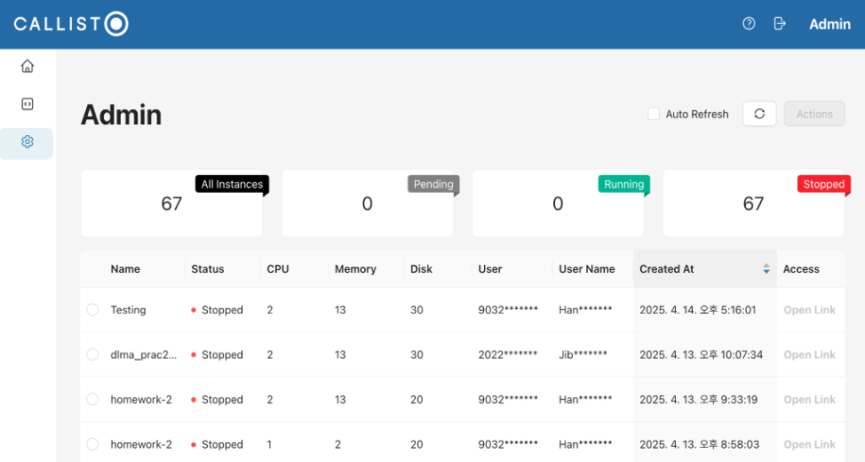
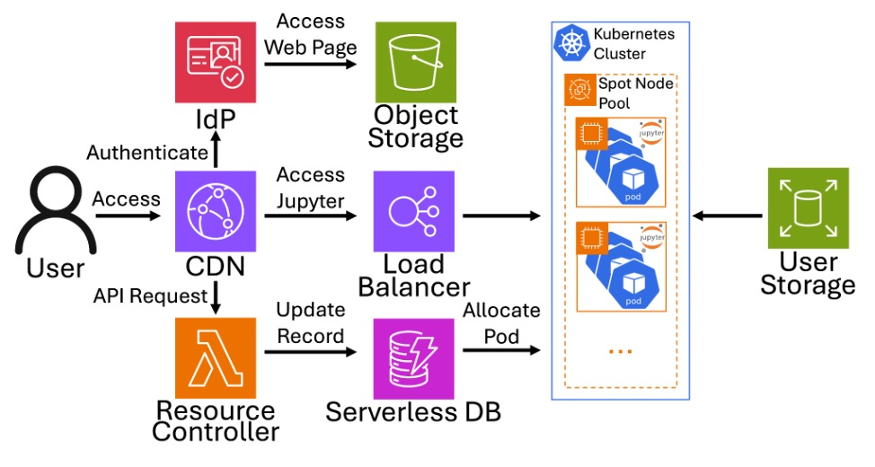

<picture>
  <source media="(prefers-color-scheme: dark)" srcset="./docs/images/logo_dark.svg" alt="callisto logo" width="300px"/>
  
</picture>

# 🚀 Cost-Efficient AI Development Platform Using Spot Instances

## 스팟 인스턴스를 활용한 비용 효율적인 AI 개발 플랫폼


Callisto is an open-source platform that combines **serverless computing** and **spot instances** to provide a highly cost-effective AI development environment. It automatically provisions and terminates resources, supports secure authentication, and minimizes idle resource costs — ideal for research, education, and lightweight production use cases.

Callisto는 **서버리스 컴퓨팅**과 **스팟 인스턴스**를 결합하여 비용 효율적인 AI 개발 환경을 제공하는 오픈소스 플랫폼입니다. 자원을 자동으로 생성·회수하고, 안전한 인증을 지원하며, 유휴 리소스의 비용을 최소화합니다.

---

## ✨ Features



- 🔐 **Serverless authentication with JWT**  
  Stateless, secure user authentication using JSON Web Tokens (JWT).

- ☁️ **Dynamic spot instance provisioning**  
  Uses AWS `price-capacity-optimized` strategy to launch cost-effective and stable spot instances.

- 💤 **Idle session auto-termination**  
  Automatically shuts down unused environments to prevent unnecessary charges.

- 📉 **Verified cost savings**  
  Up to 77.44% reduction in real-world classroom deployments.


## 🏗 Architecture



- **Frontend**: React-based UI for login and Jupyter session requests  
- **Backend**: Stateless API via AWS Lambda and API Gateway  
- **Compute**: EKS + Karpenter for spot-based auto-scaling


## 📦 How to deploy  

- You need change the contents of variables.tf file.
- Run the command below :

    ```bash
    terraform init
    terraform apply --auto-approve
    ```

## 📊 Cost Comparison  

| Platform                    | Monthly Cost (Est.) | Savings |
|----------------------------|---------------------|---------|
| AWS SageMaker              | $2,168.00           | -       |
| Azure ML Notebook          | $1,780.00           | -       |
| GCP Vertex AI Workbench    | $1,650.00           | -       |
| **Callisto**               | **$516.00**         | **76.2%↓** |

> In a real university class with 40 students, the total cost was only **$34.43** over 50 days.  


## 🤝 Contributing

- Fork the repo and create a PR from `dev` branch  
- Submit issues for bugs or feature requests  

## 📄 License

This project is licensed under the terms of the GNU General Public License v3.0.
